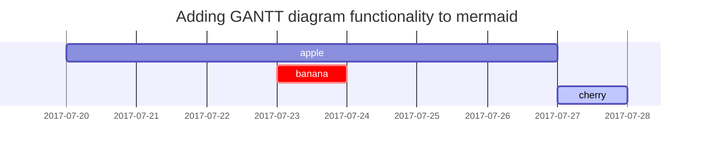

# Markdown Cheat Sheet

Thanks for visiting [The Markdown Guide](https://www.markdownguide.org)!

This Markdown cheat sheet provides a quick overview of all the Markdown syntax elements. It can’t cover every edge case, so if you need more information about any of these elements, refer to the reference guides for [basic syntax](https://www.markdownguide.org/basic-syntax) and [extended syntax](https://www.markdownguide.org/extended-syntax).

## Basic Syntax

These are the elements outlined in John Gruber’s original design document. All Markdown applications support these elements.

### Heading

# H1
## H2
### H3

### Bold

**bold text**

### Italic

*italicized text*

### Blockquote

> blockquote

### Ordered List

1. First item
2. Second item
3. Third item

### Unordered List

- First item
- Second item
- Third item

### Code

`code`

### Horizontal Rule

---

### Link

[Markdown Guide](https://www.markdownguide.org)

### Image


## Extended Syntax

These elements extend the basic syntax by adding additional features. Not all Markdown applications support these elements.

### Table

| Syntax | Description |
| ----------- | ----------- |
| Header | Title |
| Paragraph | Text |

### Fenced Code Block

```
{
  "firstName": "John",
  "lastName": "Smith",
  "age": 25
}
```

### Footnote

Here's a sentence with a footnote. [^1]

[^1]: This is the footnote.

### Heading ID

### My Great Heading {#custom-id}

### Definition List

term
: definition

### Strikethrough

~~The world is flat.~~

### Task List

- [x] Write the press release
- [ ] Update the website
- [ ] Contact the media

### Emoji

That is so funny! :joy:

(See also [Copying and Pasting Emoji](https://www.markdownguide.org/extended-syntax/#copying-and-pasting-emoji))

### Highlight

I need to highlight these ==very important words==.<mark>very important words</mark>.

### Subscript

H~2~O

### Superscript

X^2^

This post is to show Markdown syntax rendering on [**Chirpy**](https://github.com/cotes2020/jekyll-theme-chirpy/fork), you can also use it as an example of writing. Now, let's start looking at text and typography.


## Titles
---
# H1 - heading

<h2 data-toc-skip>H2 - heading</h2>

<h3 data-toc-skip>H3 - heading</h3>

<h4>H4 - heading</h4>
---
<br>

## Paragraph

I wandered lonely as a cloud

That floats on high o'er vales and hills,

When all at once I saw a crowd,

A host, of golden daffodils;

Beside the lake, beneath the trees,

Fluttering and dancing in the breeze.

## Lists

### Ordered list

1. Firstly
2. Secondly
3. Thirdly

### Unordered list

- Chapter
  - Section
    - Paragraph

### Task list

- [ ] TODO
- [x] Completed
- [ ] Defeat COVID-19
  - [x] Vaccine production
  - [ ] Economic recovery
  - [ ] People smile again

### Description list

Sun
: the star around which the earth orbits

Moon
: the natural satellite of the earth, visible by reflected light from the sun

## Block Quote

> This line shows the _block quote_.

## Prompts

> An example showing the `tip` type prompt.
{: .prompt-tip }

> An example showing the `info` type prompt.
{: .prompt-info }

> An example showing the `warning` type prompt.
{: .prompt-warning }

> An example showing the `danger` type prompt.
{: .prompt-danger }

## Tables

| Company                      | Contact          | Country |
|:-----------------------------|:-----------------|--------:|
| Alfreds Futterkiste          | Maria Anders     | Germany |
| Island Trading               | Helen Bennett    | UK      |
| Magazzini Alimentari Riuniti | Giovanni Rovelli | Italy   |

## Links

<http://127.0.0.1:4000>

## Footnote

Click the hook will locate the footnote[^footnote], and here is another footnote[^fn-nth-2].

## Images

- Default (with caption)

{: width="972" height="589" }
_Full screen width and center alignment_

<br>

- Shadow

{: .shadow width="1548" height="864" style="max-width: 90%" }
_shadow effect (visible in light mode)_

<br>

- Left aligned

{: width="972" height="589" style="max-width: 70%" .normal}

<br>

- Float to left

  {: width="972" height="589" style="max-width: 200px" .left}
  "A repetitive and meaningless text is used to fill the space. A repetitive and meaningless text is used to fill the space. A repetitive and meaningless text is used to fill the space. A repetitive and meaningless text is used to fill the space. A repetitive and meaningless text is used to fill the space. A repetitive and meaningless text is used to fill the space. A repetitive and meaningless text is used to fill the space. A repetitive and meaningless text is used to fill the space. A repetitive and meaningless text is used to fill the space. A repetitive and meaningless text is used to fill the space. A repetitive and meaningless text is used to fill the space. A repetitive and meaningless text is used to fill the space."

<br>

- Float to right

  {: width="972" height="589" style="max-width: 200px" .right}
  "A repetitive and meaningless text is used to fill the space. A repetitive and meaningless text is used to fill the space. A repetitive and meaningless text is used to fill the space. A repetitive and meaningless text is used to fill the space. A repetitive and meaningless text is used to fill the space. A repetitive and meaningless text is used to fill the space. A repetitive and meaningless text is used to fill the space. A repetitive and meaningless text is used to fill the space. A repetitive and meaningless text is used to fill the space. A repetitive and meaningless text is used to fill the space. A repetitive and meaningless text is used to fill the space. A repetitive and meaningless text is used to fill the space."

<br>

## Mermaid SVG



## Mathematics

The mathematics powered by [**MathJax**](https://www.mathjax.org/):

$$ \sum_{n=1}^\infty 1/n^2 = \frac{\pi^2}{6} $$

When $a \ne 0$, there are two solutions to $ax^2 + bx + c = 0$ and they are

$$ x = {-b \pm \sqrt{b^2-4ac} \over 2a} $$

## Inline code

This is an example of `Inline Code`.

## Filepath

Here is the `/path/to/the/file.extend`{: .filepath}.

## Code block

### Common

```
This is a common code snippet, without syntax highlight and line number.
```

### Specific Languages

#### Console

```console
$ env |grep SHELL
SHELL=/usr/local/bin/bash
PYENV_SHELL=bash
```

#### Shell

```bash
if [ $? -ne 0 ]; then
    echo "The command was not successful.";
    #do the needful / exit
fi;
```

### Specific filename

```sass
@import
  "colors/light-typography",
  "colors/dark-typography"
```
{: file='_sass/jekyll-theme-chirpy.scss'}

## Reverse Footnote

[^footnote]: The footnote source
[^fn-nth-2]: The 2nd footnote source